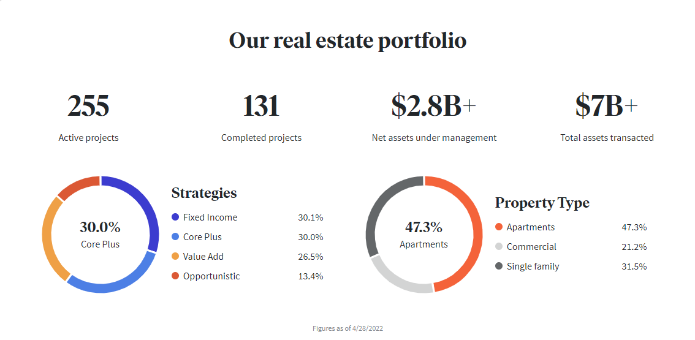
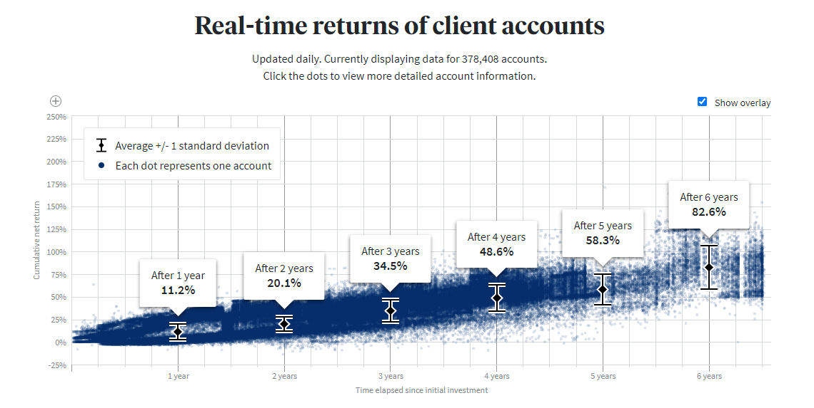
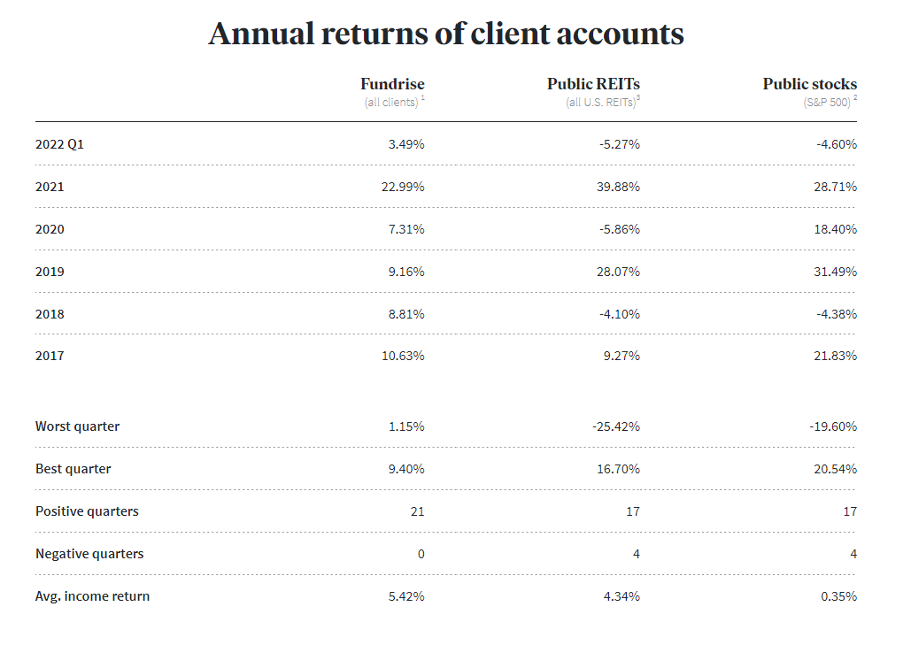

#  **Fundrise** - <mark> An Emerging Real Estate & Financial Services Company </mark>

## Overview and Origin

Founded in 2010, **Fundrise** is becoming America's leading direct-to-investor real estate investment platform. By providing access to a global portfolio of institutional-quality, residential real estate at a touch of a button, investors both big and small may now invest outside of the public markets in private real estate. This option allows for the reduction of risks and improvement of portfolio stability and div ersification within the Mortgage/Real Estate Domain. 

**Fundrise** is a FinTech company based in Washington, D.C. It was created as an online investment platform by Kenneth Shin, Brandon Jenkins, and two brothers, Ben & Dan Miller *(Wikipedia)*. Co-founder and CEO, Ben Miller has stated publicly that "Our goal is to build a better financial system for the individual investor---one that is simpler, more reliable, lower cost and transparent." *(Fundrise Website)*

**Fundrise** has been labeled as the first company to successfully crowdfund capital into the real estate market. CrowdFund Insider reported on September 26, 2014 that a total of $38M had been raised. A majority of this funding was provided by the Chinese social networking company Renren who invested $31M.  First round Series A investors also included Guggenheim Partners, Rockrose President - Justin Elghanayan, and Forest City CEO & Chairman - James Ratner. Other investors included Debbie Ratner Salzberg of Forest City, Terrence Rohan of Index Ventures, Onyx Equities co-founder Jon Schultz, Michael Gerwiz of Potomac Investment Properties, Artemis Real Estate Partners CEO Debbie Harmon, and Haniel Lynn of Corporate Executive Board. At that time, **Fundrise** had raised more capital in a first-round Series A than any other equity crowdfunding company *(CrowdFund Insider 2014)*. By 2015, **Fundrise** had committments for $100M in investments.

In 2021, **Fundrise** received $200M in credit from Goldman Sachs to invest in developing single family homes across America's SunBelt (Wikipedia). The steady-state growth and foundation for the corporation has also led to **Fundrise** being selected for the Forbes Fintech 'Top 50' list in 2015, 2016, 2017, and 2019.

The **Fundrise** portfolio has grown significantly since its inception in 2010. Today, over $7B has been transacted by **Fundrise**.  As of April 28, 2022, **Fundrise** has over $2.8B in assets under management with 131 completed projects and 255 currently active projects.  

## Business Activities

Since its founding, **Fundrise** has given more than 30,000 investors the opportunity to own private real estate. Today, this number has increased to more than 300,000 global investors. It is expected that this number will soon grow as the FinTech industry matures and more notoriety is brought to the organization.  Through the online Web2.0 and app portals, everyday investors are able to invest in properties of their choice for as little as $100/sh or as much as $10M.  

Historical returns have been favorable from 2017-2022: 
* Annual Returns of Clients Accounts: https://fundrise.com/client-returns

The **Fundrise** business model supports and specializes in the following: 
* Providing access to everyday investors (regardless of how big or small) to one of the most profitable asset classes, real estate.

* Allowing for strong, stable passive income of ~6% annual yield thru private REITS and more advanced investment options

* Employing strategies for well-rounded and diversified portfolios specifically for investor's goals risk tolerances.

* Deploying active management of the portfolios by managing all deals in-house, increasing the value of the asset over time with hands-on management and maintaining partnerships with local operators.

* Sustaining low-cost investments through software technology and eliminating the need for high advisory and management fees, reducing processes needed to scale thru automation.  

**Fundrise** uses its technology and support to execute as a financial technology company, investment manager, real estate private equity firm, proptech company, and an investment advisor for its 300,000+ clients *(Moneycrashers 2022)*.

## Landscape

The real estate industry has been slow to adapt to change and emerging technologies.  Furthermore, the real estate industry has been traditionally riddled with inefficiencies, from blatant mismanagement to excessive fee structures. For decades, this went unrecognized within the industry for two primary reasons: 

(1) The industry has been extremely profitable, historically speaking, and 

(2) Outdated regulations ensured that only the largest institutions and wealthiest investors could participate.

**Fundrise** is quickly becoming a competitive force within the mortgage and real estate industry.  The FinTech company has been able to save investors millions by bringing operations in-house and automating processes that would typically involve third parties and time-consuming bottlenecks to securing and transacting deals.  

Today, other real estate crowdfunding companies exist. And the market is becoming more competitive.  Competitors now in this space include the following:

*  Streitwise- Focuses on commercial and mixed-use properties. Annual dividend targets 8-9%. Minimum investment at $5,000. Primary investments are 2nd-tier cities.

* Diversyfund- Focuses on apartment complexes. 5-yr non-liquid, long-term investments ONLY. Lower entry levels at $500.

* GroundFloor- Returns of 8-10% on 'B' and 'C' grade loans. Minimum investment at $1000. Primary investments are hard money lenders specializing in short-term loans to house flippers. 

* YieldStreet- Dividend yields of 8% on real estate, fine art, consumer debt, corporate debt, and other assets. Minimum investment at $1000. 

* CrowdStreet- Closed funds Impact Housing REIT and Medalist Diversified REIT. Annual dividend targets 12-30%. Minimum investment at $25,000. 

## Results

Fintech breakthroughs by **Fundrise** now penetrate barriers once allowed only by accredited investors — people with a net worth exceeding $1,000,000 or income over $200,000 ($300,000 for married couples). The U.S. government does not allow smaller investors the same opportunities as wealthier investors. Fortunately, now more real estate crowdfunding companies allow non-accredited investors to participate *(Moneycrashers 2022)*.

* Annual Yield Returns and Dividends are used as performance metrics for this emerginging domain.  For cumulative real-time returns of client accounts, visit: https://fundrise.com/client-returns

* **Fundrise** Annual Yield Return comparisons to 'Public REITS' and 'Public Stocks' from 2017-2022 (Q1)

## Recommendations

Recommendations for future growth include <mark>(not limited to)</mark>:
* Mergers & Acquisitions within the space: Reduce competition by acquiring firms such as YieldStreet and broaden portfolio and client base to include fine art, corporate debt, etc. The debt market alone is worth more than $1T.

* Enter the NFT market in order to broaden the clientele base to span an underserved base for the <$1000 investor market segmentation.  Based on the initial NFT craze of 2021, consumers seem to be interested in owning non-fungible claims to digital art, original "one of a kind" physical artwork, musical compositions, etc.  Trading in NFTs spiked 21,000% to more than $17B in 2021 (CNBC 2022). Imagine a world where anyone would be able to purchase and own an allocated satoshi amount of the Mona Lisa which will undoubtedly increase in value over time and can be passed down to family heirs------ or used as a store of value within a family trust.

* Expand marketing campaigns and client access to increase liquidity across Asia, Europe, Africa, and South America. 

## References

* 79 Fintech Companies & Startups to Keep in Your Back Pocket  https://builtin.com/fintech/fintech-companies-startups-to-know
* Fundrise Website                                                     https://fundrise.com
* CNBC https://www.cnbc.com/2022/03/10/trading-in-nfts-spiked-21000percent-to-top-17-billion-in-2021-report.html

* Wikipedia                                                            https://en.wikipedia.org/wiki/Fundrise
* Crowdfund Insider                                                    https://www.crowdfundinsider.com/2014/09/50892-fundrise-adds-big-name-investors-including-ratner-elghanayan-guggenheim-funding-now-38-million/
* Moneycrashers          https://www.moneycrashers.com/best-fundrise-alternatives-competitors/
